# Learn Remix 3 — A Complete Concept Guide

> Written for this project (a Remix 3 starter app), but explains the **whole framework**, not just this codebase.
> Everything here matches the Remix version installed in `node_modules/remix` (v3 RC). If you ever doubt
> something, `node_modules/remix/INDEX.md` is the canonical doc index for the installed version.

---

## Table of contents

1. [What is Remix?](#1-what-is-remix)
2. [The six design principles](#2-the-six-design-principles)
3. [The mental model: Request in, Response out](#3-the-mental-model-request-in-response-out)
4. [How a request flows through the whole app](#4-how-a-request-flows-through-the-whole-app)
5. [The runtime layer: server.ts and adapters](#5-the-runtime-layer-serverts-and-adapters)
6. [Routing: routes as a typed URL contract](#6-routing-routes-as-a-typed-url-contract)
7. [Controllers and actions](#7-controllers-and-actions)
8. [Middleware: the pipeline that shapes every request](#8-middleware-the-pipeline-that-shapes-every-request)
9. [Typed request context](#9-typed-request-context)
10. [The Remix UI component model](#10-the-remix-ui-component-model)
11. [State, props, and updates](#11-state-props-and-updates)
12. [Styling: css(), mix, and cascade layers](#12-styling-css-mix-and-cascade-layers)
13. [Hydration and browser interactivity](#13-hydration-and-browser-interactivity)
14. [Cancellation: signals everywhere](#14-cancellation-signals-everywhere)
15. [Forms and mutations (HTML-first)](#15-forms-and-mutations-html-first)
16. [Streaming UI with Frames](#16-streaming-ui-with-frames)
17. [Data, validation, and databases](#17-data-validation-and-databases)
18. [Auth, sessions, and security](#18-auth-sessions-and-security)
19. [Assets: the bundlerless pipeline](#19-assets-the-bundlerless-pipeline)
20. [Errors: expected vs unexpected](#20-errors-expected-vs-unexpected)
21. [Testing](#21-testing)
22. [Production concerns](#22-production-concerns)
23. [How Remix 3 differs from Remix 2 / React frameworks](#23-how-remix-3-differs-from-remix-2--react-frameworks)
24. [Suggested learning path](#24-suggested-learning-path)

---

## 1. What is Remix?

Remix is a **full-stack TypeScript framework** for building web applications. One `remix` package
gives you: typed routing, middleware, a UI component model with server rendering + browser hydration,
navigation, styling primitives, data validation, sessions/auth, asset serving, and a test runner.

The core idea: **the web platform already solved most problems — build on it instead of replacing it.**

- A route receives a Web `Request` → returns a Web `Response`. That's the entire contract.
- HTML is rendered on the server from components, streamed to the browser.
- Browser JavaScript is *optional* and *incremental*: pages work without it, and get better with it.
- URLs are typed values shared by the server and the browser — never magic strings.

### Theory: why "HTML-first"?

This is the philosophy underneath everything (sometimes called *progressive enhancement*):

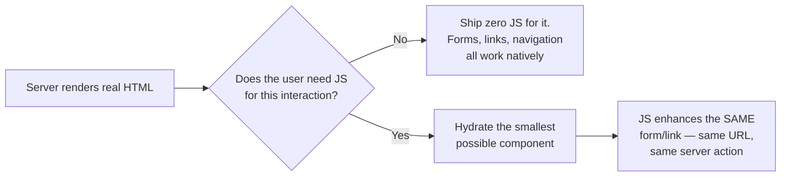

The rule of thumb: **build the feature so it works with JavaScript disabled, then layer
JavaScript on top to make it nicer.** The server action stays the single source of truth either way.

---

## 2. The six design principles

These explain *why* the framework looks the way it does:

1. **Model-First Development** — docs, code and abstractions are optimized for LLMs reading them (this app even ships an agent skill).
2. **Build on Web APIs** — `Request`, `Response`, `URL`, `FormData`, `Headers`, streams. Learn them once, use them everywhere (server, browser, tests, any runtime).
3. **Religiously Runtime** — no bundler required, no codegen, no static analysis. Routes and middleware are ordinary code that runs as-is. (Node runs the TypeScript directly via `remix/node-tsx`.)
4. **Avoid Dependencies** — `package.json` here has exactly **one** runtime dependency: `remix`.
5. **Demand Composition** — every piece (router, UI, sessions, assets…) is a focused package, usable independently, replaceable.
6. **Distribute Cohesively** — all of it ships through one `remix` package with subpath imports like `remix/router`, `remix/ui`, `remix/middleware/render`.

---

## 3. The mental model: Request in, Response out

Everything in Remix is a fetch handler:

```ts
let response = await router.fetch(request) // Request → Response, always
```

That single call is identical whether it comes from Node, Bun, Deno, a Cloudflare Worker — **or a test**.
This is why Remix apps are so testable: the app *is* a function from requests to responses.

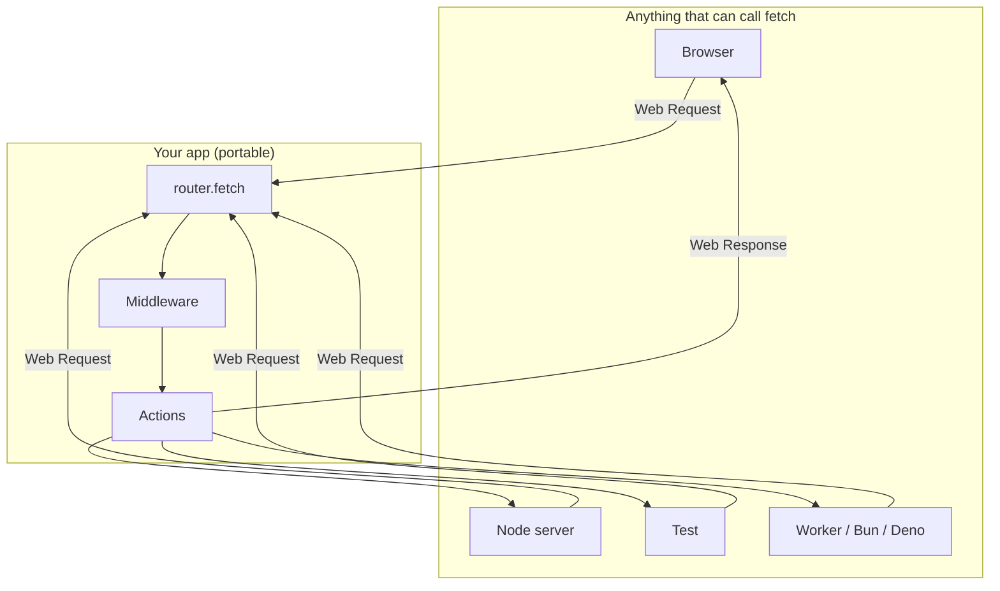

**Key theory point:** the response can be *anything* — an HTML page, JSON, a redirect, a file, a
stream, a 404. Rendering is not special; `context.render(...)` is just a middleware helper that
turns a component tree into an HTML `Response`.

---

## 4. How a request flows through the whole app

This is the map of this very project. Keep it nearby — every later section zooms into one box.

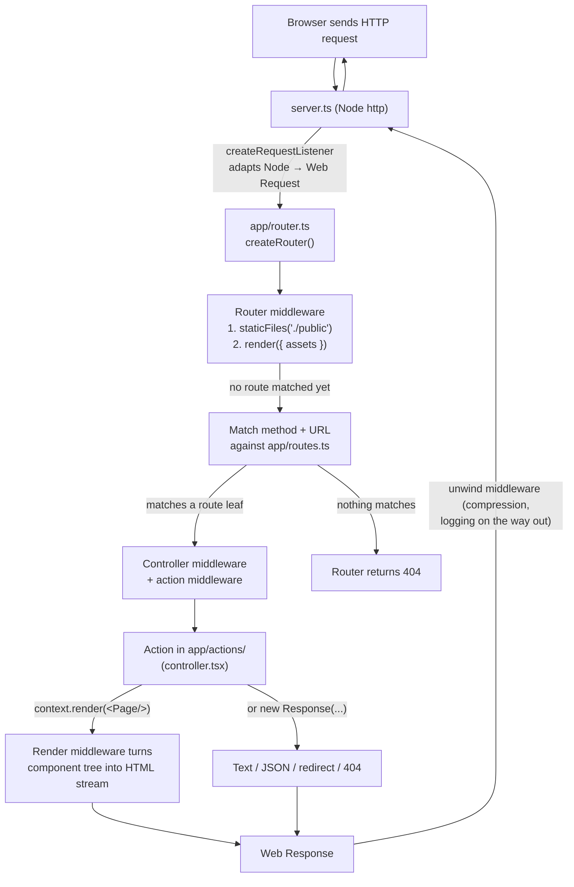

And the file → responsibility mapping (this is the "starter layout" convention):

```txt
server.ts              # Node concerns only: port, TLS, shutdown. Never touch app logic.
app/
├── routes.ts          # The URL contract: names, patterns, methods, href helpers
├── router.ts          # Glue: middleware stack + route→controller mappings + app context type
├── assets.ts          # Browser asset pipeline config (what JS/CSS may be served to clients)
└── actions/
    ├── controller.tsx     # Root controller: one action per root route leaf
    ├── home-page.tsx      # Route-local UI (page for the home route)
    ├── document.tsx       # Shared document shell (<html><head>…)
    ├── controller.test.ts # Router smoke test
    └── public/            # ⚠️ BROWSER-reachable source (entry.ts, prompt-button.tsx)
```

**The `public/` convention matters:** any file under a `public/` directory is allowed to be compiled
and served to the browser. Everything else is server-only. The trust boundary is visible in the
file tree.

---

## 5. The runtime layer: server.ts and adapters

`server.ts` is the only file that knows about Node. It does three things:

1. Creates an `http.Server` with `createRequestListener(router.fetch)`.
2. The adapter converts each Node request into a Web `Request` (building the full URL, exposing
   headers/body, aborting `request.signal` on client disconnect), and writes the Web `Response` back out.
3. Handles graceful shutdown (`SIGINT`/`SIGTERM` → stop accepting, close connections, exit).

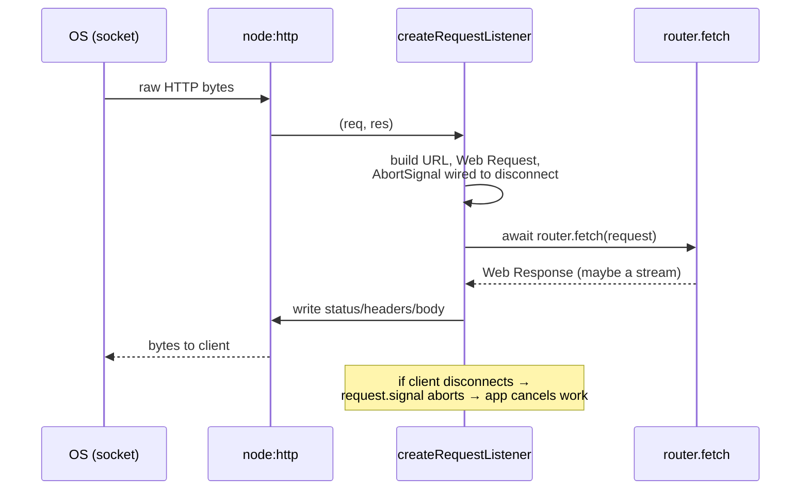

Because the router is portable, other runtimes need **no adapter at all**:

```ts
Bun.serve({ fetch: router.fetch })
Deno.serve({ port: 44100 }, router.fetch)
export default { fetch: router.fetch } // Cloudflare Worker
```

Caveat: the *router* is portable, but individual middleware may not be (e.g. `staticFiles()` and
`compression()` use Node filesystem/compression APIs). On a worker you'd serve assets through the
platform instead.

---

## 6. Routing: routes as a typed URL contract

### The separation idea

Routes (URLs + methods) are defined **separately** from the code that handles them. Why?

- Browser modules can import `routes.ts` to build links/forms without pulling server code into the client.
- Rename a URL pattern once → every `href()` call and form action updates via TypeScript errors.
- Tests build URLs from the same source of truth the app uses.

This project's route map (`app/routes.ts`):

```ts
import { get, route } from 'remix/routes'

export const routes = route({
  assets: get('/assets/*path'), // wildcard: serves compiled browser assets
  home: '/home',                // string form: matches ANY method
})
```

A realistic app grows it into a nested **route map** — a tree where **leaves are routes** and
**branches are groups**:

```ts
export const routes = route({
  home: '/',
  albums: route('/albums', {
    index: get('/'),                    // GET  /albums
    show: get('/:albumId'),             // GET  /albums/:albumId
    create: post('/'),                  // POST /albums
    destroy: del('/:albumId'),          // DELETE /albums/:albumId
    edit: form('/:albumId/edit'),       // GET+POST /albums/:albumId/edit
  }),
})
```

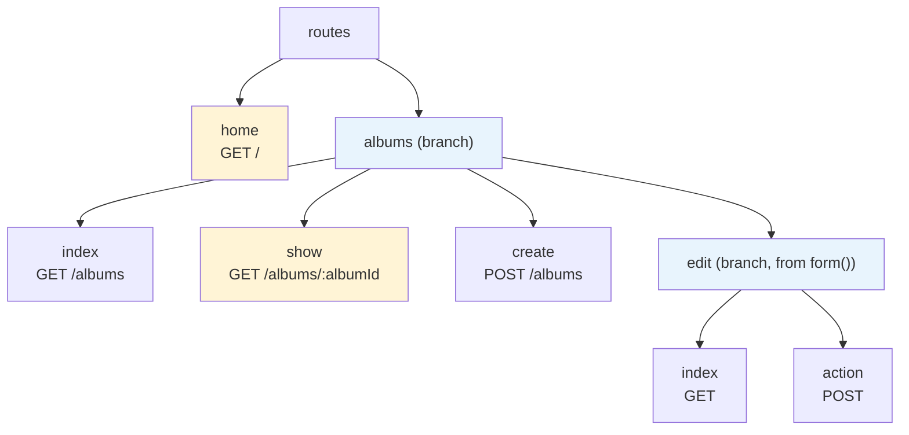

### Pattern syntax (what a URL can express)

| Syntax | Meaning | Example match |
| --- | --- | --- |
| `:albumId` | path variable → becomes `params.albumId` | `/albums/thriller` |
| `*path` | wildcard (rest of path) | `/assets/app/entry.ts` |
| `(group)` | optional group | `/docs(/v:version)` matches `/docs` and `/docs/v2` |
| `?query` | search constraint | `/search?preview` only matches with `preview=1` |
| `example.com/x` | hostname-scoped | only on that host |

### Route builders

| Helper | Creates |
| --- | --- |
| `get, post, put, patch, del, head, options` | one leaf narrowed to that method |
| `form(pattern)` | `index` (GET) + `action` (POST) at the same URL — the classic "show form / handle submit" pair |
| `route(prefix, defs)` | a nested map whose children are relative to the prefix |
| `resources(pattern)` | 7 conventional CRUD routes: `index, new, show, create, edit, update, destroy` |
| `resource(pattern)` | same for a singleton (no `index`) |

### href(): URLs as typed values

```ts
routes.albums.show.href({ albumId: 'thriller' }) // → '/albums/thriller'
```

`href` knows which params are required *from the pattern itself*. Rename `:albumId` → `:id` and
every stale call site becomes a compile error. This one feature eliminates a whole category of
broken-link bugs.

---

## 7. Controllers and actions

A **controller** owns request handling for the *direct leaves* of one route map. It's created with
`createController(routesMap, { actions })`, where each action matches a leaf by name.

This project's root controller:

```tsx
export default createController(routes, {
  actions: {
    async assets(context) {
      // serve compiled browser assets, 404 otherwise
      return (await assets.fetch(context.request)) ?? new Response('Not Found', { status: 404 })
    },
    home(context) {
      return context.render(<HomePage />) // component tree → HTML Response
    },
  },
})
```

Then register it: `router.map(routes, controller)` in `app/router.ts`. **Nested maps need their own
controllers, mapped separately** — a controller only handles its own direct leaves (middleware and
actions do *not* flow down into nested controllers; Remix even throws at startup if a leaf has no action).

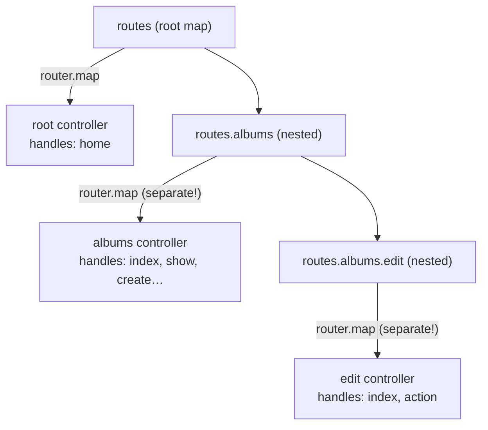

### Every action gets a typed `context`

| Property / method | Provides |
| --- | --- |
| `context.request` | the original Web `Request` |
| `context.url` | parsed `URL` |
| `context.method` | effective method (can be overridden by `methodOverride()`) |
| `context.params` | typed route params (`:albumId` → `string`) |
| `context.headers` | mutable copy of request headers |
| `context.set(key, v)` / `get(key)` / `has(key)` | request-scoped key/value store |
| `context.formData` / `context.render(...)` / `context.session`… | added by middleware (see §8–9, §15, §18) |

An action returns any `Response`: rendered HTML, `new Response('…', { status: 404 })`,
`Response.json(...)`, `redirect(url, 303)`, a file, a stream.

---

## 8. Middleware: the pipeline that shapes every request

Middleware is an onion around the action. Request travels in, response travels out:

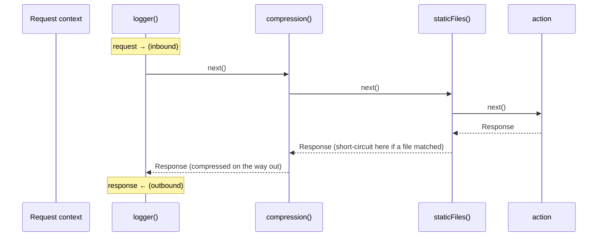

Two superpowers this gives you:

1. **Short-circuit**: return a `Response` *without* calling `next()` — this is how static files,
   auth redirects, CORS preflights, and caches answer early.
2. **Wrap**: do work after `next()` and modify the response (compression, logging, adding headers).

```ts
function timing(): Middleware {
  return async (context, next) => {
    let start = performance.now()
    let response = await next()
    console.log(`${context.method} ${context.url.pathname} ${performance.now() - start}ms`)
    return response // code after next() = outbound
  }
}
```

### Three scopes of middleware

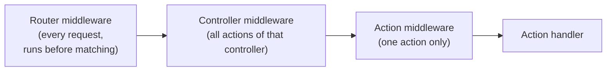

```tsx
createController(routes.albums.edit, {
  middleware: [rateLimit()], // controller scope
  actions: {
    index() { /* no formData parsing here */ },
    action: {
      middleware: [formData()], // action scope: parse the body ONLY for this action
      handler(context) {
        let title = String(context.formData.get('title'))
      },
    },
  },
})
```

### Ordering rules (dependency-driven)

- **Provider before consumer**: `formData()` before `methodOverride()` or CSRF checks.
- **Wrapper before what it wraps**: `compression()` before `staticFiles()`.
- **Fast path first**: `staticFiles()` before expensive middleware like rendering/sessions.

The standard set that ships with Remix:

| Middleware | Adds | Typical placement |
| --- | --- | --- |
| `logger()` | request/response logging, `context.logger` | first |
| `compression()` | Brotli/gzip negotiation | before everything it should wrap |
| `staticFiles(dir)` | serves GET/HEAD from a directory | early |
| `formData()` | `context.formData` (parsed body, streamed uploads) | before consumers |
| `methodOverride()` | lets `POST` + `_method` field reach PUT/PATCH/DELETE routes | after `formData()`, before matching |
| `session(cookie, storage)` | `context.session` | before anything that reads it |
| `csrf()` / `cop()` | form-token / `Sec-Fetch`-based origin checks | after session+formData |
| `auth({ schemes })` | `context.auth` | before `requireAuth()` |
| `render({ assets })` | `context.render(...)` | after fast paths |

---

## 9. Typed request context

Every middleware and action in one request shares **one context object**. Middleware can add values,
and — this is the clever part — its **TypeScript type records what it adds**, so downstream code gets
typed access without casts:

```ts
// router.ts — the app's middleware tuple defines the app context
export const router = createRouter({
  middleware: [staticFiles('./public', { index: false }), render({ assets })],
})
type AppContext = MiddlewareContext<[typeof staticMw, typeof renderMw]>

declare module 'remix' {
  interface RouterTypes { context: AppContext } // ← makes context.render() known everywhere
}
```

Theory: this is *dependency injection via the type system*. `context.formData` exists if (and only
if) `formData()` is in the stack — the compiler tracks it, not a convention doc. Custom middleware
participates too:

```ts
export const RequestId = createContextKey<string>()
export function requestId(): Middleware<{ key: typeof RequestId; value: string }> {
  return async (context, next) => {
    let id = crypto.randomUUID()
    context.set(RequestId, id)
    let response = await next()
    response.headers.set('X-Request-Id', id)
    return response
  }
}
// later, in any action:  context.get(RequestId)  → string
```

---

## 10. The Remix UI component model

Remix UI uses **JSX, but it is not React**. Forget hooks. The model is two-phase:

```tsx
function Counter(handle: Handle<{ initialCount: number }>) {
  // SETUP: runs ONCE per component instance.
  // Plain variables here are your state — they persist between renders.
  let count = handle.props.initialCount

  return () => (
    // RENDER: runs on first render and after every update.
    <button
      type="button"
      mix={on('click', () => {
        count++           // change state…
        handle.update()   // …then explicitly ask for a re-render
      })}
    >
      Count: {count}
    </button>
  )
}
```

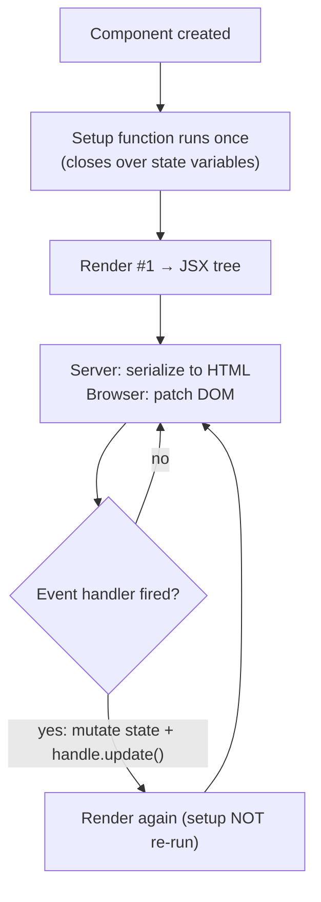

Why this design?

- **State is just JavaScript.** No `useState` rules-of-hooks, no closures-stale-bugs ceremony.
  A variable in setup scope *is* the state.
- **Updates are explicit.** Changing a variable does nothing until `handle.update()` is called.
  Renders are deterministic functions of (props, setup-scope state).
- **The same component runs on the server (→ HTML string) and in the browser (→ DOM updates).**
  Only components that need events/browser APIs ever execute in the browser.

A component's render returns a `RemixNode`: host elements (`<div>`), other components, strings,
numbers, fragments, arrays, `null` — composable trees, same as you'd expect.

Props: read them via `handle.props` inside render (the object is refreshed before each render).
Destructuring in *setup* captures only the initial value — a classic gotcha.

---

## 11. State, props, and updates

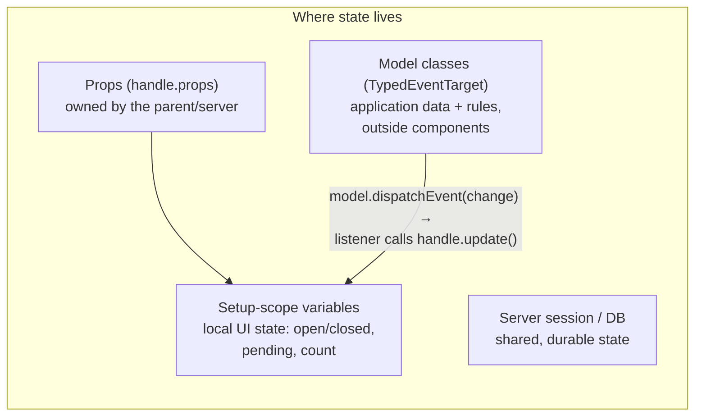

Guidelines distilled from the docs:

- Keep **UI state** in the component (menu open? saving in-flight? focused field?).
- Keep **application rules** in ordinary TypeScript models; components call them. A `CartModel`
  class dispatches a `change` event, the component listens and calls `handle.update()`. This keeps
  business logic testable without a DOM.
- **Never pass class instances through client-entry props** — those props are serialized
  server→browser (strings, numbers, plain objects, JSX only).
- Lists: give items a stable `key` (a real ID, not the array index) so Remix can move DOM nodes
  instead of recreating them.

Lifecycle utilities: `handle.id` (stable id for label/ARIA wiring), `handle.signal` (aborts when
the component disconnects), `handle.queueTask(fn)` (run DOM work right after the next commit),
`ref((node, signal) => …)` (runs when the element is inserted; signal aborts when removed),
`attrs(...)` (default attributes), component `handle.context` for typed provider/consumer context.

---

## 12. Styling: css(), mix, and cascade layers

`css({...})` takes a JS object and generates a real CSS class — supporting nesting, pseudo-selectors,
media queries — then attaches it via the **`mix`** prop:

```tsx
const card = css({
  padding: '1rem',
  borderRadius: '12px',
  '&:hover': { borderColor: '#6d28d9' },       // nested selectors work
  '@media (max-width: 40rem)': { borderRadius: 0 }, // so do media queries
})

<article mix={card}>…</article>
```

`mix` accepts **one or an array** of "mixins" — this is the unified extension point:

```tsx
mix={[
  button({ tone: 'primary' }),  // style mixin from remix/ui/button
  card,                         // your css() class
  attrs({ type: 'button' }),    // default attributes
  ref((node) => {}),            // DOM insertion hook
  on('click', handler),         // event listener
  link(href),                   // client navigation behavior
]}
```

Key mechanics worth knowing:

- During server render, Remix **collects generated rules, deduplicates them, and inlines
  `<style data-rmx-style>` tags in the head** — pages arrive fully styled with zero client JS.
- Use `css()` for **static** rules; use the plain `style` prop for values that change every update
  (opacity, transforms) — otherwise you'd mint a new class per value.
- Generated rules live in the native CSS cascade layer **`rmx`**. Your app declares layer order once:
  `@layer base, rmx, app;` — layers before `rmx` are defaults Remix may override, layers after it can
  deliberately override Remix. Brand tokens (colors, spacing) belong to the **app**, not Remix.
- First-party UI comes in three ownership levels: **style mixins** (`remix/ui/button` — keep native
  controls), **composed controls** (`remix/ui/accordion`, `select`, `tabs`…), and **headless
  primitives** (`remix/ui/*/primitives` — behavior only, you own the markup).

---

## 13. Hydration and browser interactivity

The server always renders. Hydration is an **opt-in, per-component boundary**:

```tsx
// app/actions/albums/edit/public/album-edit-form.tsx
// (inside public/ = allowed to be served to the browser)
export const AlbumEditForm = clientEntry(
  import.meta.url,             // tells the asset server which module to compile
  function AlbumEditForm(handle: Handle<{ album: Album }>) {
    let pending = false
    return () => (
      <form action={routes.albums.edit.action.href({ albumId: handle.props.album.id })} method="post"
        mix={on('submit', () => { pending = true; handle.update() })}>
        <button disabled={pending}>{pending ? 'Saving…' : 'Save'}</button>
      </form>
    )
  },
)
```

The full boot sequence:

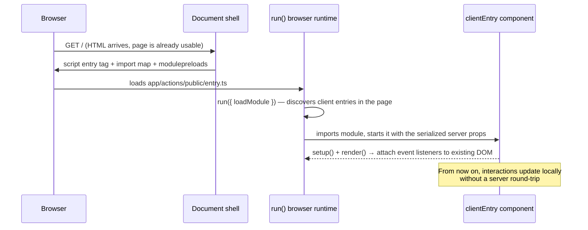

- `clientEntry(...)` marks the **smallest** component that needs the browser. Siblings and ancestors
  stay static HTML. Don't hydrate a whole page out of habit.
- `run()` in `entry.ts` **hydrates** — it is *not* a second router. Browser requests still go to the
  same server actions that own the behavior.
- `createRoot(container)` is the escape hatch for client-only UI with no server-rendered markup.
- **Client navigation**: real `<a href>` elements are automatically enhanced (same-origin, via the
  Navigation API) after `run()` starts. `navigate(href, { history })` for code, `link(href)` to make
  any element act like a link.

### Progressive enhancement in one diagram

```mermaid
flowchart TD
    F["<form action=POST-route>"] -- "JS disabled" --> B1["Browser does a full-page POST<br/>server action validates + redirects"]
    F -- "JS on: on('submit') handler" --> B2["preventDefault, fetch(form.action,<br/>FormData, signal)"]
    B2 --> C1{"response ok?"}
    C1 -- "no" --> C2["render inline error locally"]
    C1 -- "yes" --> C3["navigate(response.url) —<br/>the server's redirect, replayed"]
    B1 --> D["Same server action, same URL"]
    B2 --> D
```

Both paths hit the **same action**. The enhancement never replaces server logic — it improves feedback
(pending state, inline errors) while the server remains the authority.

---

## 14. Cancellation: signals everywhere

Remix threads `AbortSignal` through every kind of async work so stale work dies early:

| Signal | Aborts when | Use for |
| --- | --- | --- |
| 2nd arg of an `on()` handler | same handler runs again, or element removed | search-as-you-type fetches |
| queued task's signal | next render or disconnect | prop-keyed post-render work |
| `handle.signal` | component disconnects | timers, global listeners |
| `request.signal` (server) | client disconnects | DB queries, upstream fetches |

```tsx
mix={on('input', async (event, signal) => {
  let response = await fetch(url, { signal }) // typing again aborts the previous fetch
  if (signal.aborted) return                  // an old response can never overwrite a new one
  resultText = await response.text()
  handle.update()
})}
```

Theory: **race-condition safety by construction.** Instead of tracking "is this still the latest
request?" by hand, the runtime guarantees that superseded work is aborted — you just check the flag.

---

## 15. Forms and mutations (HTML-first)

The canonical mutation flow — Post/Redirect/Get — works with **zero JavaScript**:

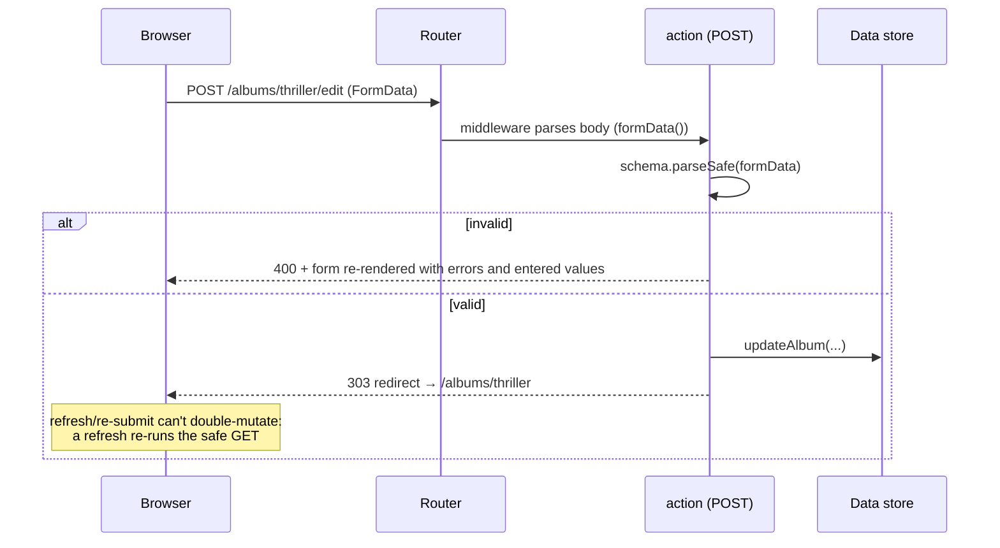

Building blocks:

1. `form('/albums/:albumId/edit')` in routes → `index` (GET shows the form) + `action` (POST handles it).
2. `formData()` middleware → `context.formData` (body parsed once; file uploads stream, not buffer).
3. `remix/data-schema` + `remix/data-schema/form-data` → validate and coerce (e.g. `'1983'` → `1983`)
   at the trust boundary:

   ```ts
   const albumFormSchema = f.object({
     title: f.field(s.string()),
     year: f.field(coerce.number()),
   })
   let result = s.parseSafe(albumFormSchema, context.formData)
   if (!result.success) return new Response('Invalid', { status: 400 })
   ```
4. On success: `redirect(routes.albums.show.href({ albumId }), 303)`.

Then enhance the same form for pending/inline-error UX (§13) — or target a frame for partial
updates (§16). Multiple submit buttons = multiple intents (check the submitter's value server-side).
PUT/PATCH/DELETE come from a hidden `_method` field + `methodOverride()` middleware, because HTML
forms only speak GET/POST.

---

## 16. Streaming UI with Frames

Most pages should be **one** component tree. But sometimes a region genuinely wants its own request:
it's slow, reloads independently after a mutation, or is shared by several pages. That's `Frame`:

```tsx
<Frame
  src={routes.albums.recommendations.href({ albumId: album.id })} // a GET route rendering ONLY that region
  fallback={<p>Loading recommendations…</p>}                      // optional
/>
```

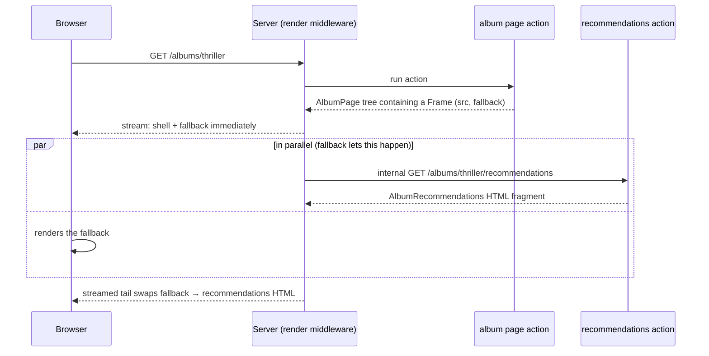

Rules of thumb:

- No `fallback` → **blocking**: one complete page, frame resolved before send.
- With `fallback` → **streamed**: page arrives now, region fills in later. The fallback is loading
  UI, not an error boundary.
- Frames are **named** (`name="cart"`) so other components can reload them:
  `handle.frames.get('cart')?.reload()`.
- Links/forms can drive frames **without JS**: `data-rmx-target="cart"` (optionally `data-rmx-src`
  for a different URL) — the runtime intercepts and reloads just that region. Back/forward and
  history are handled with `data-rmx-history="push|replace"`.
- The browser entry wires a `resolveFrame(src, options)` callback in `run()` to perform the actual
  same-origin fetch for frame requests (this project's `entry.ts` shows it, including the import-map
  polyfill for older browsers).

Theory: this is Remix's answer to "islands"/partial hydration, but **route-owned** — each frame has a
real URL, a real action, and works without JavaScript (as a plain link/form navigation fallback).

---

## 17. Data, validation, and databases

Two different validation problems, kept deliberately separate:

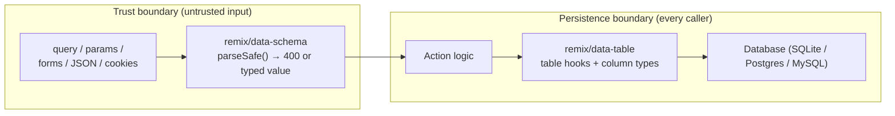

- **`remix/data-schema`** — small, standards-aligned schema validation: objects, unions, checks,
  `.refine()`, `.transform()`, coercion for form strings, `parse()` (throw) vs `parseSafe()` (result
  object) — the latter is what actions should use for clean `400`s.
- **`remix/data-table`** — typed relational toolkit: `table()` definitions, column builders,
  relations (`belongsTo`, `hasMany`…), CRUD helpers (`find`, `create`, `update`…), a `query()` DSL
  for joins/aggregates, transactions, and lifecycle hooks (`beforeWrite`, `afterRead`…).
  ⚠️ Runtime table metadata does **not** create constraints — **SQL migrations own the DDL**
  (timestamped dirs with `up.sql`/`down.sql`).
- **Request-scoped DB access**: initialize + migrate at startup, expose the db through middleware
  context (`context.get(databaseContext)`), never as a global — keeps it request-scoped, testable,
  and portable across runtimes.

---

## 18. Auth, sessions, and security

Three different layers — build them in order:

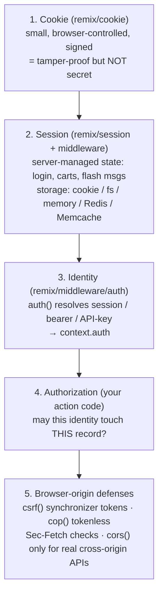

Practice notes:

- Cookie flags are deliberate choices: `httpOnly`, `secure`, `sameSite`, `path`, expiry.
  Signing ≠ encryption — contents are readable.
- Rotate the session id after login (`regenerateId(true)`); `destroy()` on logout, don't just clear a field.
- `requireAuth()` is route-protection middleware (customize `onFailure` for HTML redirect vs `401` JSON);
  **authentication ≠ authorization** — ownership/role checks still belong in the action.
- State-changing cookie-authenticated requests need CSRF defense; `session → formData → csrf` ordering matters.
- Never put secrets in browser-reachable modules (anything under `public/`).

---

## 19. Assets: the bundlerless pipeline

Remix 3 has **no bundler in dev or prod by default**. Instead, `createAssetServer()` (this project's
`app/assets.ts`) compiles TypeScript/JSX/CSS **on request**, generates import maps + `modulepreload`s,
and minifies/fingerprints in production.

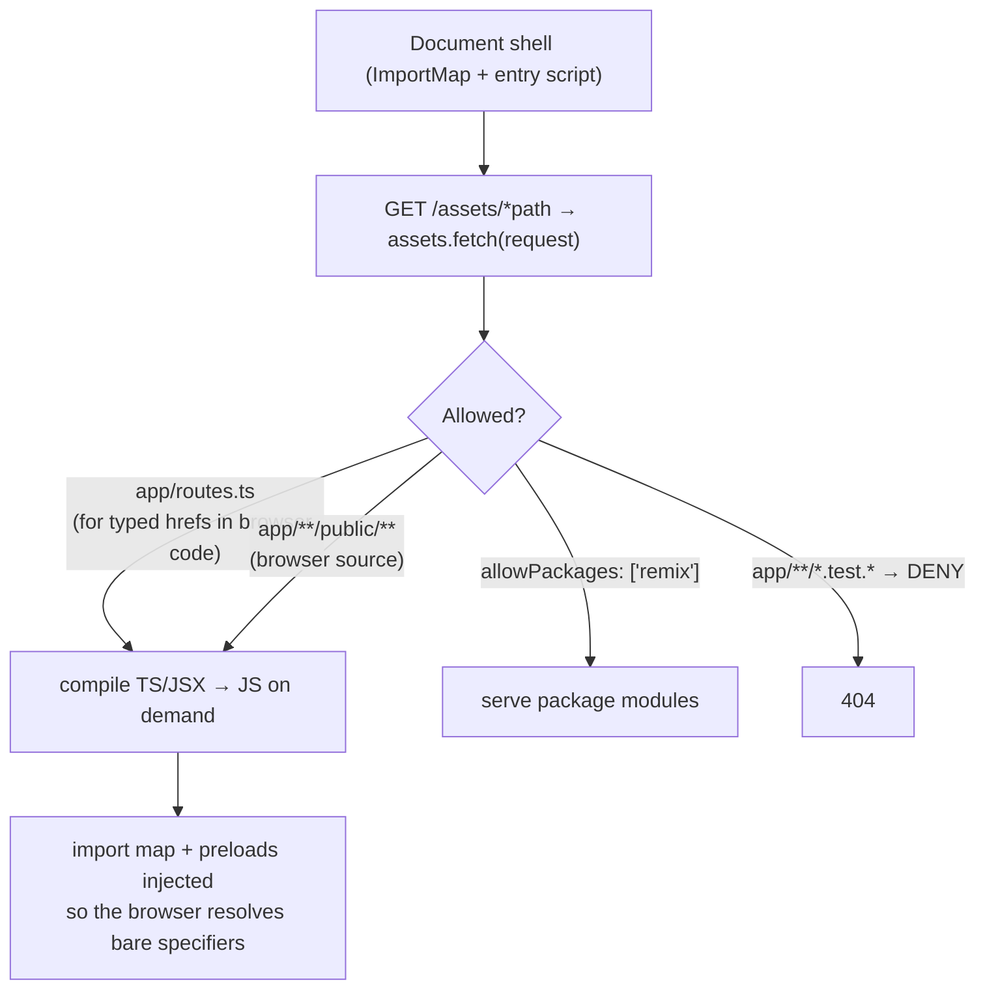

Why this matters conceptually:

- **"Religiously Runtime"** — your browser code is also just modules; no build step to debug, fast
  cold starts, files served as-is in dev with sourcemaps.
- The allow/deny lists are a **security boundary**: server-only code (data, secrets) is simply not
  reachable, and colocated `public/` dirs make the boundary readable from the file tree.
- In production, `minify: true` + fingerprinted URLs → immutable caching. `remix/ui-hmr` powers the
  hot-reload channel (`npm run hmr` in this project runs a proxy + HMR runtime).

---

## 20. Errors: expected vs unexpected

A crisp doctrine:

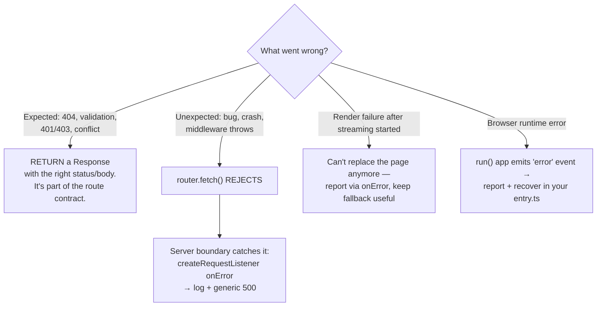

Corollaries: never throw to communicate "album not found"; keep exception details out of public
bodies; treat aborted requests (client closed the tab) as *cancellation*, not server errors.

---

## 21. Testing

Because the app is a fetch handler, most tests need **no server and no browser**:

| Boundary | Proves | How | Runner |
| --- | --- | --- | --- |
| Unit | a helper/schema/model | import + call + assert | `remix/test` (server) |
| Router | an action, middleware, session, auth flow | `router.fetch(new Request(...))` | server |
| Browser component | events, DOM updates | `remix/ui/test` render() | `*.test.browser.ts` (Playwright) |
| E2E | full flow across browser+server | drive a real browser | `*.test.e2e.ts` |

This project's smoke test (`app/actions/controller.test.ts`) is the canonical pattern:

```ts
let response = await router.fetch(new URL(routes.home.href(), 'http://localhost'))
assert.equal(response.status, 200)
assert.match(await response.text(), /<html[\s>]/)
```

Note how the test reuses `routes.home.href()` — the same typed URL helper the UI uses. Run with
`npm test` (`remix test`). Choose the *narrowest* boundary that proves the behavior; keep tests
beside the module they exercise.

---

## 22. Production concerns

A production Remix app is still "a fetch handler behind an adapter." The checklist mindset:

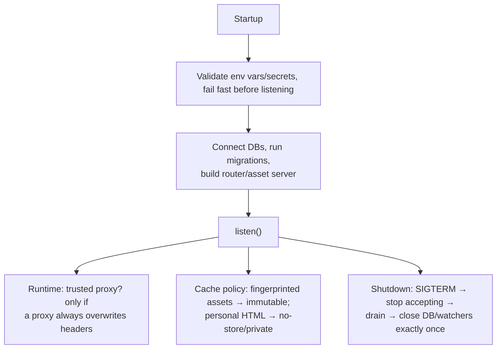

Plus: use process-safe storage for anything shared (memory sessions don't survive replicas — use
Redis/DB), add your own health-check route + metrics (Remix gives hooks, not a backend), and
propagate `request.signal` into streaming work so disconnects cancel cleanly.

---

## 23. How Remix 3 differs from Remix 2 / React frameworks

You may have seen older Remix material — almost none of it maps to this:

| Topic | Remix 2 (and Next-style) | Remix 3 (this) |
| --- | --- | --- |
| Routing | file-based (`app/routes/album.$id.tsx`) | **explicit route maps** in `routes.ts` |
| Data loading | `loader` functions per route | **no loaders** — load data in your action/controller, plain functions |
| UI library | React + React Router | **Remix UI**: its own runtime, JSX but *not* React, no hooks, no VDOM diffing rules |
| State | `useState`/hooks | **setup-scope variables** + `handle.update()` |
| Events | React synthetic events | **`on(event, handler)` mixin**, native DOM events |
| Styling | Tailwind/CSS files your choice | **`css()` + `mix`**, cascade layers, server-inlined styles |
| Build | Vite bundle, required | **bundlerless** asset server, on-demand compile |
| Nested UI + data | nested routes w/ loaders+outlets | **Frames**: route-owned regions, stream/reload independently |
| `useFetcher` etc. | client mutation APIs | **plain `fetch` + native forms**; actions return Responses |

If a tutorial mentions `loader`, `useLoaderData`, `links()`, `meta()` — it's about Remix 2, not this.

---

## 24. Suggested learning path

A sequence that builds each concept on the previous one (all doable in this repo):

1. **Run it**: `npm i && npm run dev` → open `http://localhost:44100`. Read `routes.ts`, `router.ts`,
   `controller.tsx` and match every file to the §4 diagram.
2. **Add a route**: e.g. `about: get('/about')` + an action returning `new Response('About')`. Feel the
   routes→controller→map flow.
3. **Render a page**: build it with `<Document>` + components; use `css()` and `mix`; notice the page
   is fully styled with zero JS.
4. **Add a form** the HTML-first way (§15): `form()` route, `formData()` middleware, `data-schema`
   validation, `redirect(..., 303)`. Test it with the JS console *disabled*.
5. **Hydrate one component** (§13): move the form into a colocated `public/` dir, wrap in
   `clientEntry`, add pending state. Re-enable JS.
6. **Stream a frame** (§16): extract a slow region into its own GET route + `<Frame fallback>`.
7. **Persist data** (§17): swap the in-memory store for `remix/data-table` + SQLite, run migrations.
8. **Lock it down** (§18): sessions + `requireAuth()` + CSRF on the mutating routes.
9. **Test each step** (§21) with router tests; typecheck with `npm run typecheck`.

The single habit that unlocks everything: **for every feature, first make it work as pure
HTML + a server action — then decide what, if anything, needs the browser.**

---

*Sources: installed Remix 3 docs (`node_modules/remix/INDEX.md`, `guides/01–15`) and this project's
starter code. When docs and this file ever disagree, the installed docs win.*
